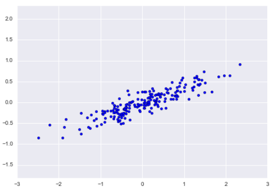
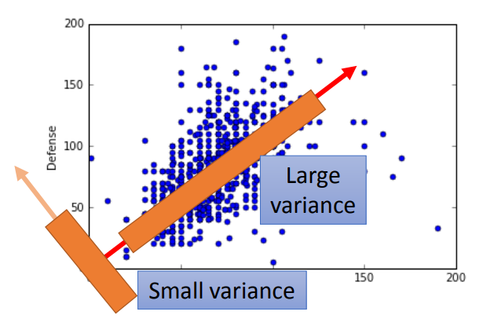
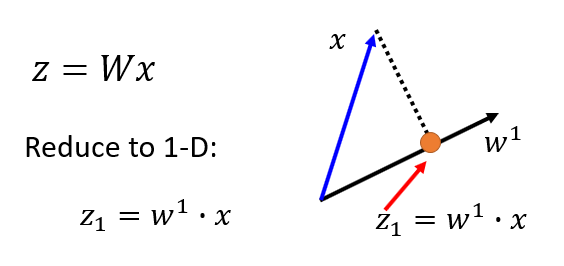
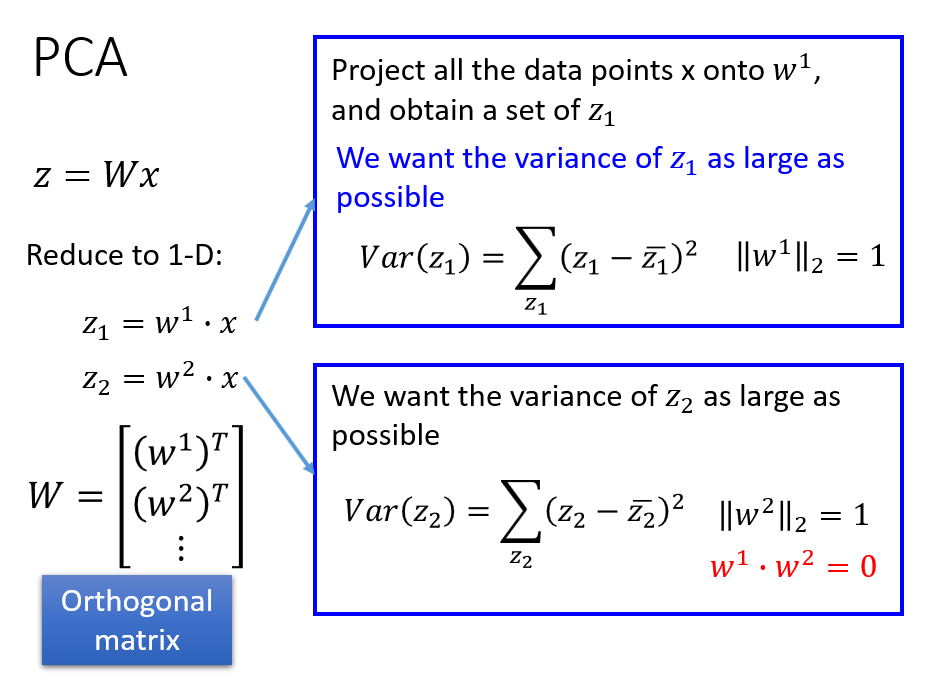
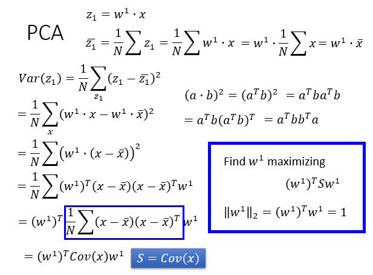
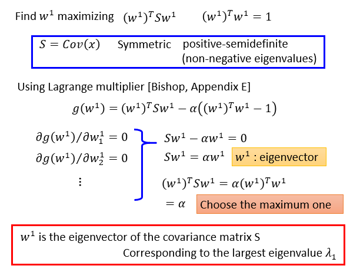
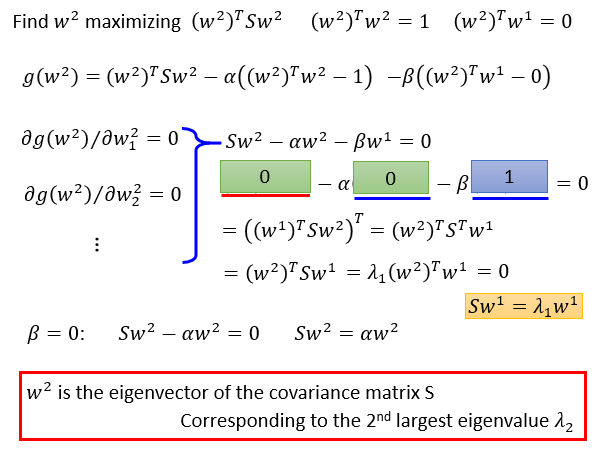
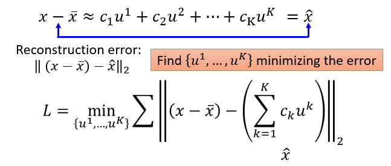
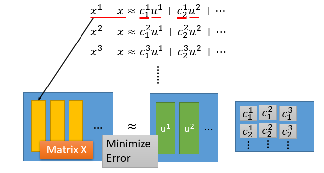

# Principle Component Analysis (PCA)

一个样本常常会由多个属性，也就是有多个维度，但是有的维度之间可能具有相关性，还有的维度则完全是噪声。主成分分析（PCA）是为了寻找样本的多个属性中的主要属性，即主成分，这些主要的成分能够很大程度上刻画样本的特征。

如下图所示，每个样本包含两个属性，其特征体现在两个垂直方向上，但是其主要特征则体现在箭头较长的那个方向上。

所以如果将样本均投影在这个方向上，就得到了降维的目的，由两维降到了一维。PCA 就是用来寻找这个主要方向的方法。

PCA 将原 M 维的数据降维至 D 维，就相当于对原来 M 维的数据做了一次坐标变换。

其基本思想有两种：

1. 让样本在变换后的各个维度上应该分的足够开，即有较大的方差。
2. 让样本在变换后的重建误差足够小

### 最大化方差

坐标变换，实际上就是对样本 x 的各个维度做一个线性组合，如下图所示 x 是变换前的样本，z 是变换后的坐标。x 维度为 M，z 维度为 D， 是单位向量。

要保证在变换后，各个维度上有较大的方差，同时满足约束条件 W 为单位正交矩阵：

首先对求方差的式子进行化简：

在约束条件下求极值，使用拉格朗日乘子法：

可以看出，要最大化  就是 S 最大特征值对应的特征向量。

相应地  就是 S 第二大的特征值对应的特征向量。

因此，主成分就是 x 的协方差的最大的 N 个特征值对应的特征向量。这里的 N 取决于实际项目需要。

### 最小化重建误差

要利用主成分重建原样本，一种方法是对主成分进行线性组合，就相当于拿主成分拼凑出原样本。另外一种方法是在所有样本的均值的基础上，加上主成分的线性组合，相当于在均值的基础上，进行修修补补得出原样本。

如果主成分具有很好的代表性，那么就能让重建误差足够小，因此可以定义损失函数：

这里  为主成分，为了让误差足够小，即让下面的等式两边足够接近。写成矩阵形式：

因为 X 的 SVD 分解，可以保证分解后的矩阵相乘得到的结果和原矩阵相近，因此 U 的各列就可以作为主成分，后面两个矩阵 ∑ 和 V 的乘积就相当于系数矩阵 C。通过调整 SVD 分解时中间矩阵的维度，就可以得到不同数量的主成分。
